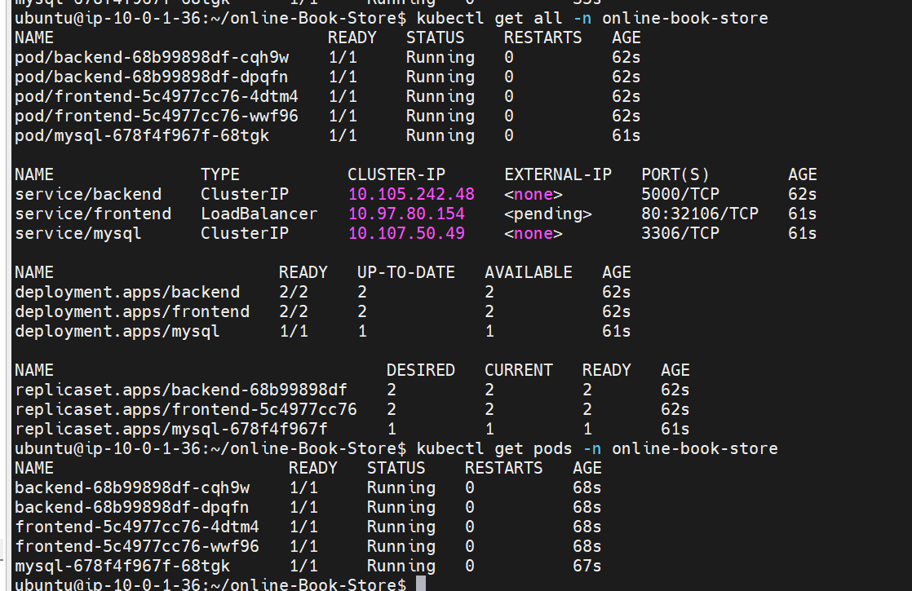

# 📚 Online Book Store

A full-stack **Online Book Store** application developed using **React.js, Node.js, Express.js, and MySQL**. The application is containerized with **Docker**, deployed using **Kubernetes**, and automated with **Jenkins CI/CD** on **AWS**.

## 🚀 Project Overview

The Online Book Store allows users to browse books and view important information such as **title, author, category, price, description, and book images**.

The project demonstrates the complete DevOps workflow from source code management to containerization, CI/CD automation, and cloud deployment.

## 🛠️ Technology Stack

| Category         | Technologies                    |
| ---------------- | ------------------------------- |
| Frontend         | React.js, HTML, CSS, JavaScript |
| Backend          | Node.js, Express.js             |
| Database         | MySQL                           |
| Containerization | Docker, Docker Compose          |
| Orchestration    | Kubernetes                      |
| CI/CD            | Jenkins                         |
| Cloud            | AWS EC2                         |
| Version Control  | Git, GitHub                     |

## ✨ Key Features

* 📚 Browse available books
* 🔍 View book details
* 💰 Display book prices and categories
* 🖼️ Display book images and descriptions
* 🔗 REST API integration
* 🐳 Docker containerization
* ☸️ Kubernetes deployment
* 🔄 Jenkins CI/CD automation
* ☁️ AWS cloud deployment

## 🏗️ Architecture

```text
              GitHub
                 │
                 ▼
              Jenkins
                 │
                 ▼
              Docker
                 │
                 ▼
            Kubernetes
          ┌──────┼──────┐
          ▼      ▼      ▼
      Frontend Backend MySQL
       React   Node.js  DB
          │      │      │
          └──────┼──────┘
                 ▼
                AWS
```

## 📁 Project Structure

```text
online-Book-Store/
├── frontend/
├── backend/
├── database/
├── kubernetes/
├── docker-compose.yml
├── Jenkinsfile
└── README.md
```

## 🐳 Run with Docker

Clone the repository:

```bash
git clone https://github.com/venujaganti/online-Book-Store.git
cd online-Book-Store
```

Start the application:

```bash
docker compose up -d --build
```

Check running containers:

```bash
docker ps
```

## ☸️ Kubernetes Deployment

Deploy the application:

```bash
kubectl apply -f kubernetes/
```

Check pods:

```bash
kubectl get pods -n online-book-store
```

Check services:

```bash
kubectl get svc -n online-book-store
```

## 🔄 CI/CD Pipeline

```text
Developer
    ↓
GitHub
    ↓
Jenkins
    ↓
Build & Test
    ↓
Docker Images
    ↓
Kubernetes
    ↓
AWS Deployment
```

Jenkins automates the application build, Docker image creation, and Kubernetes deployment process.

## 📸 Screenshots

### 🏠 Home Page


### 📚 Book Listing


### 📖 order Details


### 🐳 Docker Containers


### ☸️ Kubernetes Deployment



## 🎯 Project Objective

The objective of this project is to demonstrate practical knowledge of **full-stack application development, Docker containerization, Kubernetes orchestration, Jenkins CI/CD, Linux administration, and AWS cloud deployment**.

## 👨‍💻 Author

**Venu Jaganti**
B.Tech – Computer Science & Engineering

## 📄 License

This project is created for **educational and portfolio purposes**.
